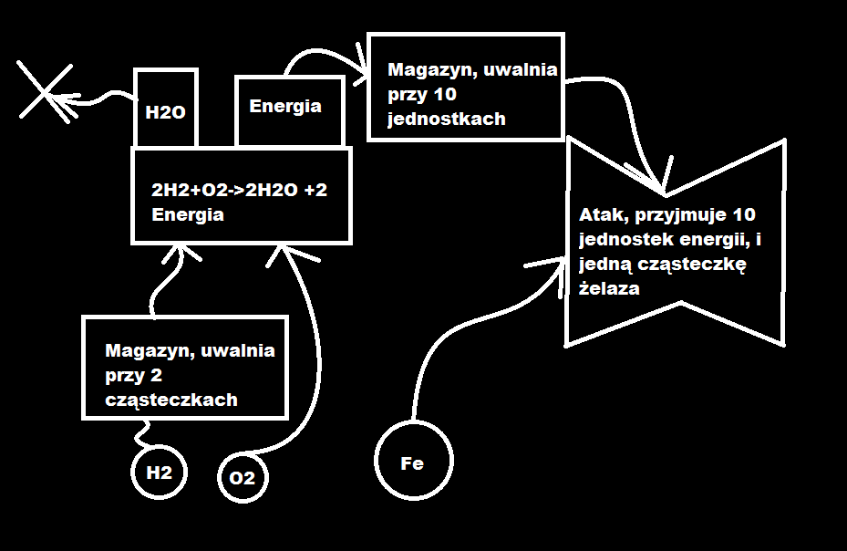
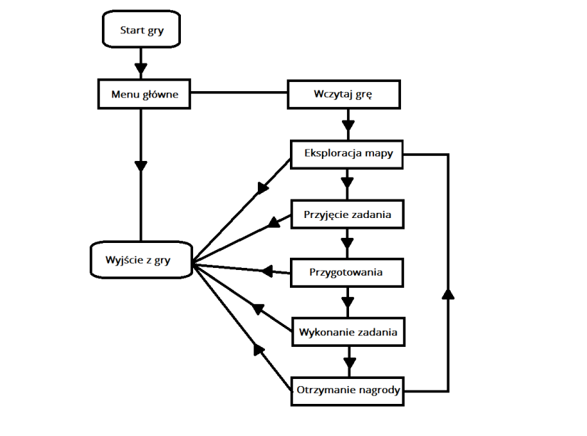
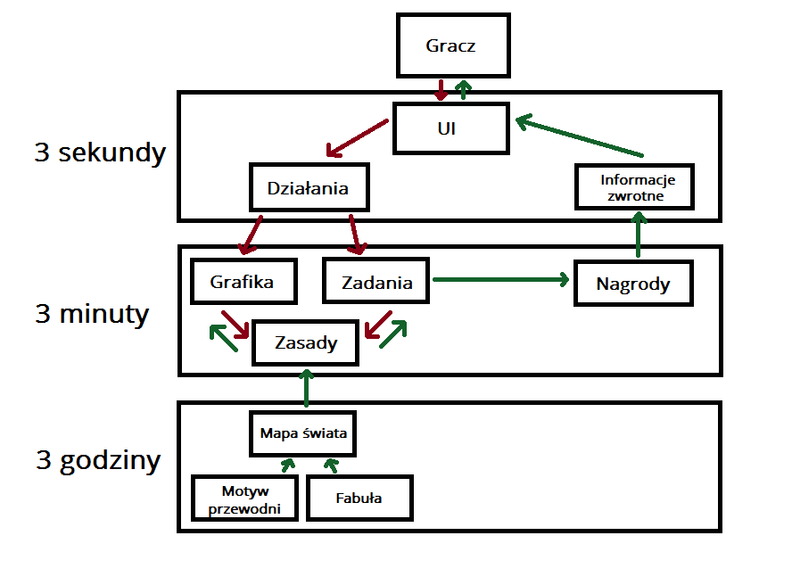
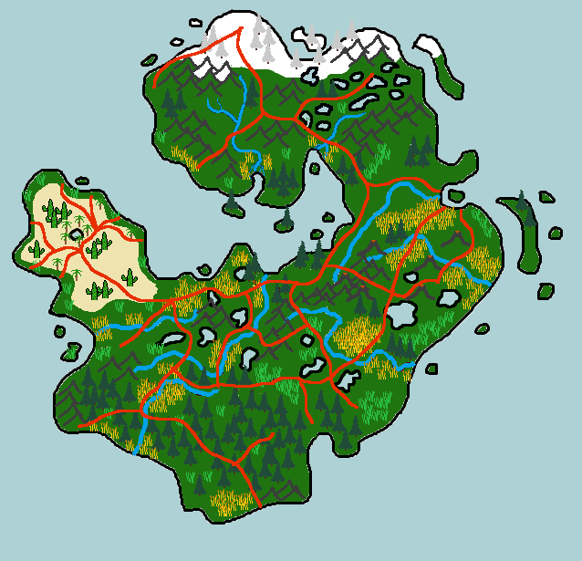
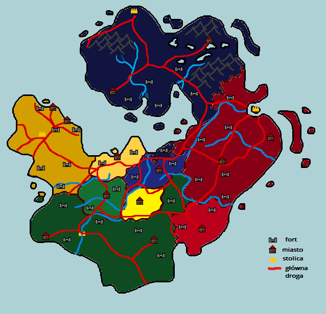
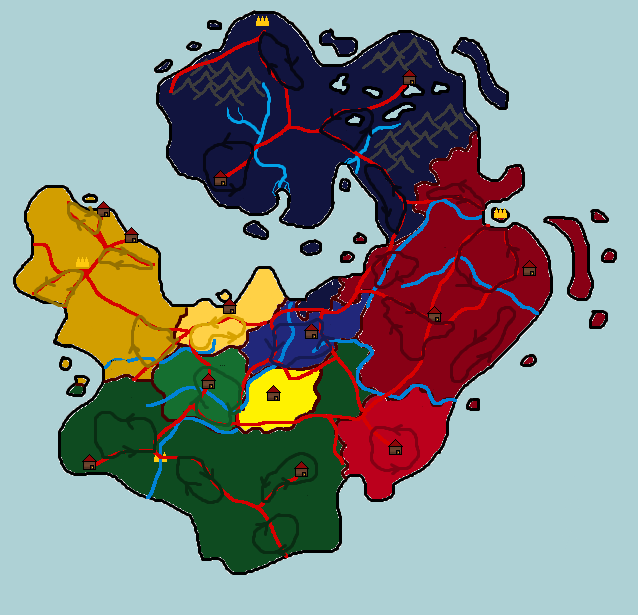

# Wizja gry

- [Vision.pdf](./game_vision/Vision.pdf) _by Tomasz D_. - wersja pre-alpha opisu gry \*
- [This is the way](./game_vision/this_is_the_way.pdf) _by Michał D._ - aktualna wersja opisu gry
- [mechanizm walki](./game_vision/Mechanika_Walki.pdf) _by Tomasz D. & Bartłomiej W._ - szczegółowy opis działania bitew \*
- [AI w bitwach](./game_vision/scheme_ai.pdf) _by Maciej Sz._ - schemat działania AI podczas bitew
- [Maszyna stanów NPCa](./game_vision/sCHEMe_enemy_state_scheme.pdf) _by Maciej Sz._ - schemat działania maszyny stanów u NPCów
- [Reakcje chemiczne + statystyki związków](./game_vision/sCHEMe_reactions.pdf) _by Bartłomiej W. & Michał D._ - możliwe do przeprowadzenia reakcje chemiczne oraz statystyki związków chemicznych (atak/leczenie/żywotność)

- 

Schemat craftingu pierwiastków <i>by Bartłomiej W.</i> - skrótowy schemat działania ataków jednostek podczas bitwy **

- 

Game Flow <i>by Michał D.</i>

- 

Architektura projektu gry by <i>Michał D.</i>

# Fabuła

- 

Mapa podstawowa <i>by Michał D.</i>

- 

Mapa z miastami i drogami <i>by Game Design Team</i>

- 

Mapa ze ścieżkami patrolowymi <i>by Game Design Team</i>

## Opisy państw

- [Auskadrin](./game_vision/Panstwo_1.pdf) _by Michał D._
- [Sułtanat Awabalu](./game_vision/Panstwo_2.pdf) _by Mateusz D._
- [Miasto Elfów](./game_vision/Panstwo_3.pdf) _by Mikołaj Sz._
- [Cesarstwo Carlsbergit](./game_vision/Panstwo_4.pdf) _by Amelia S._

## Państwa, skróty, kolory, questy

_by Amelia S., Michał D., Mateusz D. i Mikołąj Sz._ - tabela z danymi na temat królestw

| Nazwa Państwa         | Skrót | Kolor                                  | Questy                                                  |
|-----------------------|-------|----------------------------------------|---------------------------------------------------------|
| Sułtanat Awabalu      | Sul   | #d0ba1a  | [questy Awabal](./game_vision/quests_awbal.pdf)         |
| Auskadrin             | Aus   |  #0a1b7c  | [questy Auskedrinu](./game_vision/quests_auskedrin.pdf) |
| Państwo Elfów         | Elf   |  #096127  | [questy Elfy](game_vision/quests_elfy.pdf)              |
| Cesarstwo Carlsbergit | Car   |  #900c0c  | [questy Cesarstwo](game_vision/quests_cesarstwo.pdf)    |

państwa pomniejsze:

| Nazwa Państwa | Skrót | Kolor                                  |
|---------------|-------|----------------------------------------|
| Saltna        | Sal   | #74c963   |
| Calithill     | Clt   | #3b799a   |
| Tharon        | Tha   |  #7572b1  |
| Selajam       | Slm   |  #e7ea29  |
| Angwedh       | Agw   |  #dda01c  |

Apropo kolorów jeszcze jeden, który jest dość ważny i często przeze mnie używany:
#132978

---
\* - nieaktualne \
\*\* - częściowo nieaktualne
