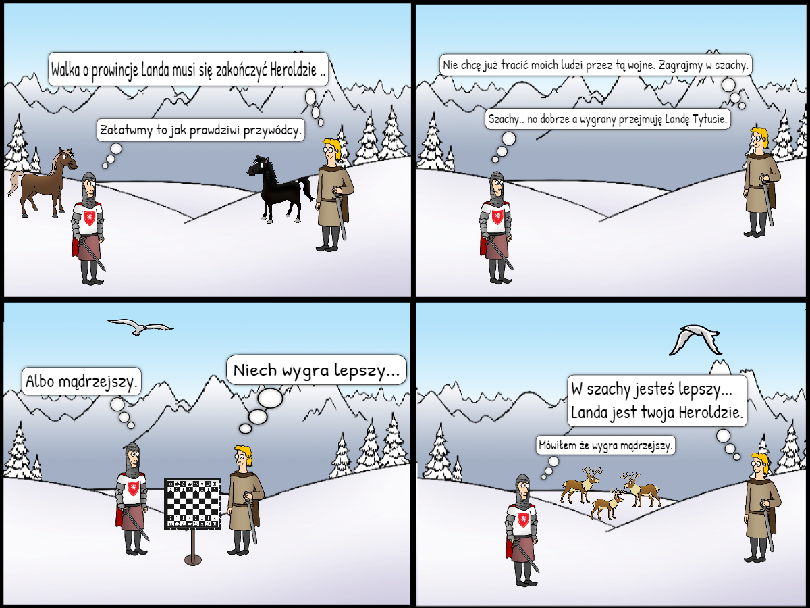

# Materiały dodatkowe

_na tej stronie znajdują się materiały nie mające bezpośredniego związku z naszą grą._

## PINTEREST

W jednym z zadań konkursowych ze stycznia pojawiła się sugestia,
aby przygotować zestaw screen-shotów z gier, z których czerpiemy
inspiracje w tworzeniu S(CHEM)E. Oto one:
[> pinterest]( https://pl.pinterest.com/neonknightsstudios/screeny-z-gier-z-kt%C3%B3rych-czerpiemy-inspiracj%C4%99/)

## KOMIKS - FABUŁA DO GRY W SZACHY

A oto kolejne z zadań, tym razem tylko jedno z możliwych wykonać.

Fabuła do gry w szachy:

**Fabuła wprowadzająca:**
Pewnego razu, podczas wojny północnej, starły się ze sobą dwie największe prowincje
na kontynencie. Chodziło o ziemię, która dawała dostęp do handlu zagranicznego
z innymi mocarstwami, jednak władcy wiedzieli, że aby ją zdobyć, trzeba będzie
poświęcić wiele żyć ludzkich. Podczas zimy, w czasie której państwa te wstrzymały
wojnę, monarchowie postanowili spotkać się. Rozmawiali o wojnie i sposobach na
rozwiązanie tego konfliktu bez przelewania krwi. Pomyśleli, że zagrają w szachy,
gdyż jest to „Symulacja wojny”. Zwycięzca tejże partii, miał wziąć we władanie
ziemię, o które toczył się spór.
